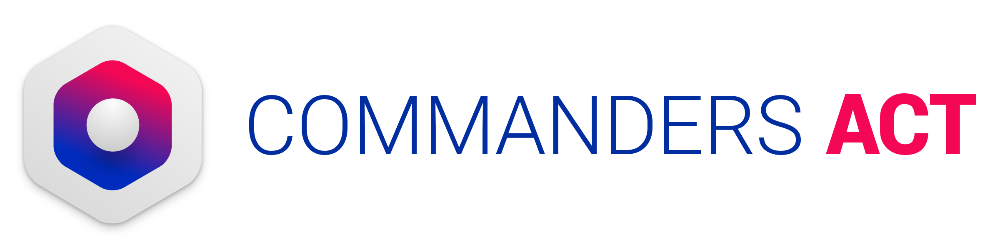

Core Guide
==========

Last update : *18/06/2026*
Release version : *5.5.0*

## Table of Contents

- [Core Guide](#core-guide)
- [Introduction](#introduction)
- [Dependencies](#dependencies)
  - [Using ProGuard](#using-proguard)
- [Support and contacts](#support-and-contacts)

Introduction
============

As we expanded Commanders Act's mobile possibilities, it rapidly became apparent that fitting everything into one big library wasn't the right approach — it's also contradictory with Tag Management itself. We decided to split capabilities into smaller modules, so you only add what you need and keep your application lightweight.

That said, a part of our code is shared across several modules. The Core module exists to avoid repetition and keep things smaller when you need more than one module.

Dependencies
============

The Core module is mandatory when using Commanders Act's mobile solution. Its dependencies are listed directly in each module's documentation rather than here.

Core is building with the following dependencies :

	implementation 'androidx.appcompat:appcompat:1.6.1'

Using ProGuard
--------------

If your release build uses ProGuard to strip and obfuscate your code, you will need to add some configuration for the modules to keep working.

Just add the following line in your proguard-rules.pro.

```
-keep class com.tagcommander.lib.** { *; }
```

You may also need to add the following rule depending on your other libraries dependencies

```
    -keep class org.json.** { *; }
```

Support and contacts
====================


***
**Support**
*support@commandersact.com*

http://www.commandersact.com
***

This documentation was generated on 18/06/2026 09:00:32