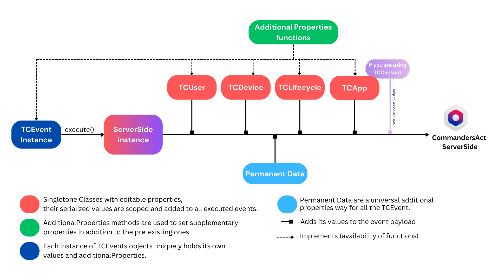
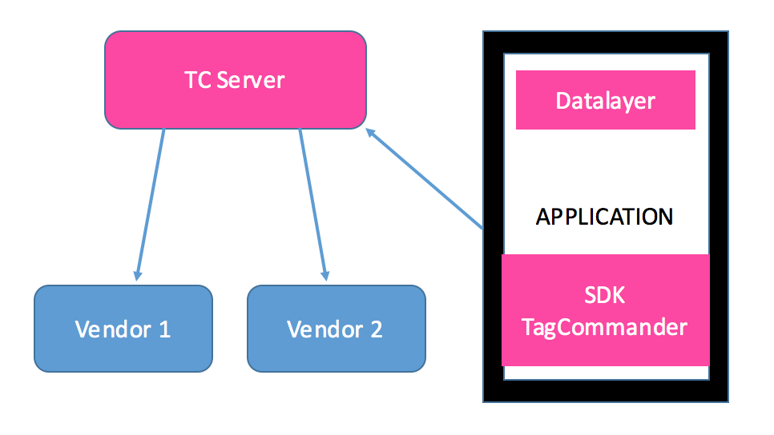

ServerSide's Implementation Guide
=================================

Last update : *05/02/2026*
Release version : *5.5.8*

## Table of Contents

- [ServerSide's Implementation Guide](#serversides-implementation-guide)
- [Introduction](#introduction)
  - [Main Technical Specifications](#main-technical-specifications)
  - [Event](#event)
  - [Commanders Act's TCEvent payloads Data](#commanders-acts-tcevent-payloads-data)
  - [Executing an event](#executing-an-event)
- [ServerSide's module integration](#serversides-module-integration)
  - [Steps](#steps)
  - [Integration of the ServerSide Module](#integration-of-the-serverside-module)
  - [Gradle additions](#gradle-additions)
  - [Android permissions](#android-permissions)
  - [Compatibility](#compatibility)
- [Using the ServerSide's module](#using-the-serversides-module)
  - [Initialisation](#initialisation)
  - [Executing events](#executing-events)
  - [Customising Events](#customising-events)
  - [Custom events](#custom-events)
  - [Video Events](#video-events)
  - [Consent](#consent)
  - [Install Referrer](#install-referrer)
  - [Background Mode](#background-mode)
  - [Deactivating the ServerSide's module](#deactivating-the-serversides-module)
  - [Getting AAID](#getting-aaid)
- [Troubleshooting](#troubleshooting)
  - [Debugging](#debugging)
  - [Testing](#testing)
  - [Network monitor](#network-monitor)
  - [Common errors](#common-errors)
- [Helpers](#helpers)
  - [Persisting variables](#persisting-variables)
- [Kotlin](#kotlin)
- [Example: TCDemo](#example-tcdemo)
- [Migration v4 to v5](#migration-v4-to-v5)
  - [Why a new version of the SDK](#why-a-new-version-of-the-sdk)
  - [Event based](#event-based)
  - [Changes](#changes)
  - [Example](#example)
  - [Useful methods](#useful-methods)
- [Support and contacts](#support-and-contacts)

Introduction
============

Commanders Act enables marketers to easily add, edit, update, and deactivate tags on web pages, videos and mobile applications with little-to-no support from IT departments.

Instead of implementing several SDK's in the application, Commanders Act for mobile provides clients with a single module which sends data to our servers which then create and send information to your partners.

Thanks to remote configuration tools, it is also possible to modify the configuration without having to resubmit your application.

The purpose of this document is to explain how to add the ServerSide module into your application.


Main Technical Specifications
-----------------------------

- Weight about 40 ko in your application.
- Fully threaded and asynchronous.
- Offline mode (the hits are stored in the phone to be replayed when is convenient)
- Very low CPU and memory usage.
- Information collected and sent automatically while respecting GDPR.
- Background mode, in the case you need to send data while the application is in background.

Event
-----

An event represent something happening inside your application. For example, we have "add to cart" or "login" events.
Inside the library they are represented each by a specific class which in turn provide you with information needed for this event to be used by your solutions.

For example, we know that for a "view cart" event, you will have to provide a list of the items inside the cart for the event to be valid.
We also add "value" and "currency" that are generally used by solutions for this event that can be filled inside the class.

Your company alongside our consulting team will usually define step by step what events the want the application to send and what parameters are needed for the solutions which will in turn treat those events.

You should be provided with a document explaining all events you need to implement inside your application and when they should be sent.

The event and the information we gather independently will create a hit to our servers with a JSON payload.

Commanders Act's TCEvent payloads Data
--------------------------------------

Our TCEvents payloads consist of various sections organized within a JSON payload sent to our CommandersAct servers once you call the `execute` function.
Each section has its specific behaviour. Refer to the provided scheme for insights into each section, guidance on manipulation, changing values, and understanding intended behavior.




> [!WARNING]  
> All events and their payloads are detailed here with code examples: [events-reference](https://doc.commandersact.com/developers/tracking/events-reference)

You will also find information about what you can add inside the TCUser which is sent with every hit.
Be aware that some data inside TCUser require consent from the user te be read and used.

> [!WARNING]  
> You can also check this page to see the link between the event names and the SDK's Class names and all information inside the payload here:
[mobile-sdk-event-specificity](https://community.commandersact.com/platform-x/developers/tracking/about-events/mobile-sdk-event-specificity)

Executing an event
------------------

When you call the sendData method, a hit will be packaged and sent to Commanders Act's server.



ServerSide's module integration
===============================

Steps
-----

You can divide the integration of TagCommander's ServerSide module into the next few steps:

 1. Adding the Core and ServerSide libraries to your Project.
 2. Implementing the ServerSide module and adding events to your application.
 3. Verify that all tags are being sent.

Integration of the ServerSide Module
------------------------------------

[Please check the Developers Implementation Guide to chose the best way to implement this module in your project.](./README.md)

Gradle additions
----------------
You might need to add some dependencies in your build.gradle file for the ServerSide's module to work properly.

```
    implementation 'androidx.appcompat:appcompat:1.4.1'
```

Android permissions
-------------------
TagCommander requires the following permissions:

  - android.permission.INTERNET
  - android.permission.ACCESS_NETWORK_STATE
  - android.permission.ACCESS_WIFI_STATE


Compatibility
-------------
- Minimum Android version: 17
- Build Target version: 31
- Build Tools Version: 28.0.3


Using the ServerSide's module
=============

Initialisation
--------------

It is recommended to initialize TCServerSide in your `onCreate(Bundle savedInstanceState)` in your `MainActivity` so it will be operational as soon as possible.

You will need 2 things provided by our consulting team. A siteID which is representing the web platform in which you setup your destinations.
And a sourceKeyID which will represent the Android source inside your setup.

You need to pass your application context while instantiating TCServerSide.

If you are using our Consent module, you can also change during this initialisation the default TCServerSide behaviour while waiting for the user consent.
More information a bit later in this document.

A single line of code is required to initialize an instance of TCServerSide, and you can add one more for better logging:

```java
    //!\\ Important while integrating TCServerSide
    TCDebug.setDebugLevel(Log.VERBOSE);
    TCServerSide TCS = new TCServerSide(siteID, sourceKey, appContext);
```

Executing events
----------------

Each time you are required to launch an event, simply instantiate the corresponding event, fill it with what your tagging plan suggest and execute it.

in java : 

```java
    ArrayList<TCItem> items = new ArrayList<>();
    items.add(new TCItem("iID1", new TCProduct("pID1", "pName1", 1.5f), 1));
    items.add(new TCItem("iID2", new TCProduct("pID2", "pName2", 2.5f), 2));
    TCPurchaseEvent event = new TCPurchaseEvent("ID", 11.2f, 4.5f, "EUR", "purchase", "creditCard", "waiting", items);
    TCS.execute(event);
```

in kotlin : 

```kotlin
    val items: ArrayList<TCItem> = ArrayList()
    items.add(TCItem("iID1", TCProduct("pID1", "pName1", 1.5f), 1))
    items.add(TCItem("iID2", TCProduct("pID2", "pName2", 2.5f), 2))
    val event = TCPurchaseEvent("ID", 11.2f, 4.5f, "EUR", "purchase", "creditCard", "waiting", items)
    serverSide.execute(event)
```

Customising Events
---------------------

Events are tailored for the most common solutions' needs. But you might need to add properties that are not specified in the event you are trying to send.

You can choose to edit your events by directly accessing the event object property, or you can choose to add new properties. Depending on your needs, you can use the following methods to achieve this.

```java
    public void addAdditionalProperty(String key, String value)
    public void addAdditionalProperty(String key, JSONObject value)
    public void addAdditionalProperty(String key, Boolean value)
    public void addAdditionalProperty(String key, BigDecimal value)
    public void addAdditionalProperty(String key, Float value)
    public void addAdditionalProperty(String key, Integer value)
    public void addAdditionalProperty(TCDynamicStore store)
```

Also, for accessing & removing already added properties :

```kotlin
    public ConcurrentHashMap<String, Object> getAdditionalProperties()
    public void removeAdditionalProperty(String key)
    public void clearAdditionalProperties()
```

Here for example this could be tracking some user going back to your configuration to open the consent interface. And you would want to know what was the consent before re-opening.
Of course this is a simple example only here to show the addAdditionalProperty method.

in java : 

```java
    TCPageViewEvent pageViewEvent = new TCPageViewEvent("Consent");
    pageViewEvent.pageName = "Configuration";
    pageViewEvent.addAdditionalProperty("currentConsent", "refused");
```

in kotlin : 

```kotlin
    val pageViewEvent = TCPageViewEvent("Consent")
    pageViewEvent.pageName = "Configuration"
    pageViewEvent.addAdditionalProperty("currentConsent", "refused")
```
    
If you want to customize the other fields in your events, you can directly edit properties on the coresponding singleton instance (except for TCLifecycle) or use custimisation methodes.

Please note that these are constant fields across the events, changes will be applied to all events at once.
Here's a list of the available editable fields :

- TCDevice.getInstance()
- TCNetwork.getInstance()
- TCUser.getInstance()
- TCApp.getInstance()
- TCLifecycle.getInstance()
- TCItem and TCProduct objects

For TCDevice's inner fields. Os & Screen are accessible via :

in java : 

```java
    TCDevice.getInstance().getOsProperties()
    TCDevice.getInstance().getScreenProperties()
```

in kotlin : 

```kotlin
    TCDevice.getInstance().osProperties
    TCDevice.getInstance().screenProperties
```

Custom events
-------------

In some case, the classic events might not suit your needs, in this case you can build complete custom events.
It is important to name them properly as this will be the base of forwarding them to your destinations.

in java : 

```java
    TCCustomEvent event = new TCCustomEvent("eventName");
    event.addAdditionalProperty("myParam", "myValue");
    TCS.execute(event);
```

in kotlin : 

```kotlin
    val event = TCCustomEvent("eventName")
    event.addAdditionalProperty("myParam", "myValue")
    TCS.execute(event)
```

Video Events
------------

There are 4 main video events classes : TCVideoSettingEvent, TCVideoPlaybackEvent, TCVideoContentEvent & TCVideoAdEvent.

Every Video event will have multiple modes, choose the right mode for each event you're sending.

You'll have to manage your video_session_id across the video events you're sending.

if you have multiple videos, you'll need to set a different video_session_id for every one of them.

example : 

in java : 

```java
    TCVideoAdEvent event = new TCVideoAdEvent(ETCVideoAdMode.video_ad_start, "0000-0000-00001"); // first video
    TCVideoAdEvent event_2 = new TCVideoAdEvent(ETCVideoAdMode.video_ad_playing, "0000-0000-00001"); // another event for the first video!
    serverSide.execute(event);
    serverSide.execute(event_2);

    TCVideoAdEvent event_3 = new TCVideoAdEvent(ETCVideoAdMode.video_ad_start, "0000-0000-00002"); // second video
    TCVideoAdEvent event_4 = new TCVideoAdEvent(ETCVideoAdMode.video_ad_playing, "0000-0000-00002"); // another event for the second video !
    serverSide.execute(event_3);
    serverSide.execute(event_4);
```

in kotlin : 

```kotlin
    val event = TCVideoAdEvent(ETCVideoAdMode.video_ad_start, "0000-0000-00001") // first video
    val event_2 = TCVideoAdEvent(ETCVideoAdMode.video_ad_playing, "0000-0000-00001") // another event for the first video!
    serverSide.execute(event)
    serverSide.execute(event_2)


    val event_3 = TCVideoAdEvent(ETCVideoAdMode.video_ad_start, "0000-0000-00002") // second video
    val event_4 = TCVideoAdEvent(ETCVideoAdMode.video_ad_playing, "0000-0000-00002") // another event for the second video !
    serverSide.execute(event_3)
    serverSide.execute(event_4)
```

Consent
-------

To manage the privacy of the user's data you can use our Consent product, another product or nothing at all.

By default, the ServerSide module will try to see if you have added our Privacy module. If so, it will put itself into a waiting for consent mode.
In this mode, it will record all hits but wait to consent information to either send everything or delete all waiting hits.

If you don't use our Consent module, the ServerSide's will be enabled by default.

If you want to change this behaviour, we added a way to initialise the ServerSide module with additional information about the behaviour.
We have 3 behaviours:

	- PB_DEFAULT_BEHAVIOUR which is the one described just before
	- PB_ALWAYS_ENABLED which forces the ServerSide's module to always send information. This is used when you have tags that don't require consent.
	- PB_DISABLED_BY_DEFAULT which forces the ServerSide's module to disabled. It won't record hits before consent is given and you won't have any up by default time when using tagging the app loading screens. This is used when you're not using our Consent module.


Consent will then be forwarded inside the TCUser. For more information, please check documentation about the [Consent module](./TCConsent/README.md). 


To initialise the ServerSide's module with another behaviour, please call the following function:

```java
	TCS = new TCServerSide(siteID, sourceKey, appContext, ETCConsentBehaviour.PB_DEFAULT_BEHAVIOUR);
```


Install Referrer
----------------

If you want the source channel of your application in Commanders Act, please point the INSTALL_REFERRER broadcast toward our receiver TCReferrerReceiver :

It's as simple as adding the following lines in the AndroidManifest.xml of your application and inside the "Application" tag.

```xml
    <receiver
        android:name="com.tagcommander.lib.TCReferrerReceiver"
        android:exported="true">
        <intent-filter>
            <action android:name="com.android.vending.INSTALL_REFERRER" />
        </intent-filter>
    </receiver>
```

Once the broadcast is received, TagCommander will store the full string into the #TC_INSTALL_REFERRER# predefined variable.

Example:

```
    utm_source=adMob&utm_medium=banner&utm_term=running+shoes&utm_content=theContent
    &utm_campaign=couponReduc&anid=adMob
```

Background Mode
---------------

While the application is going to background, the ServerSide's module sends all data that was already queued then stops. This is in order to preserve battery life and not use carrier data when not required.

But some applications need to be able to continue sending data because they have real background activities. For example listening to music.

For those cases, we added a way to bypass the way the ServerSide's module usually react to background. Please call:

```java
	TCS.enableRunningInBackground();
```
One drawback is that we're not able to ascertain when the application will really be killed. In normal mode, we're saving all hits not sent when going in the background, which is not possible here anymore. To be sure to not loose any hits in background mode, we will save much more often the offline hits. This only applies if the ServerSide is offline, meaning that you don't have internet.

Deactivating the ServerSide's module
------------------------------------

We have two ways to enable/disable our ServerSide module. The one described here should be used when your are not using our Consent module.

If you want to show a privacy message to your users allowing them to stop the tracking, you might want to use the following function to stop it if they refuse to be tracked.

```java
    TCS.disableServerSide();
```

What this function does is stopping all systems in the ServerSide's module that update automatically or listen to notifications like background or internet reachability. This will also ignore all calls to the SDK by your application so that nothing is treated anymore and you don't have to protect those calls manually.

```java
	TCS.enableServerSide();
```

In the case you need to re-enable it after disabling it the first time, you can use this function.

Getting AAID
------------

For privacy reason, the server-side module can't read and use the AAID automatically. We need to first be sure that your user have accepted the corresponding category inside the privacy.

```java
	ServerSideInstance.addAdvertisingIDs();
```

This method will check and add if possible the AAID and the boolean "is ad tracking enabled".

Troubleshooting
===============

The ServerSide also offers methods to help you with the Quality Assessment of the implementation.

Debugging
---------

We recommend using `Log.VERBOSE` while developing your application:

```java
    /*
     * Verbose is recommended during test as it prints information
     * that helps figuring what is working and what's not.
     */
	TCDebug.setDebugLevel(Log.VERBOSE);
```

  - Verbosity

  Constant Name  | Verbosity
  -------------  | ---------
  `Log.VERBOSE`  | Print everything.
  `Log.DEBUG` | Most useful information for debugging
  `Log.INFO` |  Basic information about TagCommander's state
  `Log.WARN`  | Warnings only
  `Log.ERRORS` | Errors only
  `Log.ASSERT` | Assertions only (not used).

  - The internal architecture is working with internal notifications. You can ask the Logger to display all the internal notifications with TCDebug.setNotificationLog(true);.

If you don't call TCDebug.setDebugLevel, no log will be printed at all.

You can choose to print events with pretty format via the following method call : 

```java
    /*
     * Tells the logger if we should display Event with pretty format.
     */
	TCDebug.enablePrettyFormat(true);
```

Testing
-------

There are four ways to verify that the module executes the tags in your application:

 - By reading the debug messages in the console.
 - To check the interfaces inside the platform.
 - By going to your vendor's platform and check that the hits are displayed and that the data is correct. Please be aware that hits may not display immediately in the vendor account. This delay differs widely between vendors and may also vary for the type of hit under the same vendor.
 - You can also use a network monitor like Wireshark or Charles to check directly what is being sent on the wire to your vendors.


Network monitor
---------------

Starting Android 7 (Nougat) you will have more troubles while trying to profile your applications with tools like Charles. Google introduced [changes to trusted certificates](https://android-developers.googleblog.com/2016/07/changes-to-trusted-certificate.html).

Basically what is needed in order to see https hits in Charles and alike is a bit more configuration than just adding SSL certificate to the phone. You will need to add in your manifest application:
```xml
	android:networkSecurityConfig="@xml/network_security_config"
```

And create a file named network_security_config.xml under the res/xml folder which should contain:

```xml
	<network-security-config>
		<base-config>
		  <trust-anchors>
		      <certificates src="system" />
		      <certificates src="user" />
		  </trust-anchors>
		</base-config>
	</network-security-config>
```

With this, you should be set!


Common errors
-------------

> [!TIP]
> - Make sure you have the latest version.
> 
> - Enable the debug logs if you have any doubt.
> 
> - Check if TCServerSide is called when you think it should be. You should see it in the console logs or inside the monitoring interface.
> 
> - Make sure a second time that you have the latest version. (this really is the most common issue)
>
> - Check all your IDs

Helpers
=======

Persisting variables
--------------------

The ServerSide module can help storing variables that remain the same in the whole application, such as vendors ID, in a TCServerSide instance, instead of passing them to the events instance each time you want to execute an event.

Those variables will be passed in all events as additional parameters and will persist for the whole run of the application.

```java
    TCS.addPermanentData("VENDOR_ID", "UE-55668779-01");
```

They can also be removed if necessary.

```java
    TCS.removePermanentData("VENDOR_ID");
```

Kotlin
======

If you want to use Kotlin as your main language, there is absolutely nothing special to do.
Compile with the latest versions and call our module as usual.

Example: TCDemo
===============

To check an example of how to use this module, please check:

[TCDemo](https://github.com/CommandersAct/TCMobileDemo-V5/tree/master/Android/)

Migration v4 to v5
==================

Why a new version of the SDK
----------------------------

CommandersAct made a big move forward to bring all his products together in a whole new platform.

As the mobile counterpart of all products we needed to re-work our SDKs in the same manner and create more logical connections with the whole suit.

We have renamed some modules to this end. SDK is now named ServerSide as it is only used to send information to our platform.
And TCPrivacy has been renamed to Consent since it is the name of our product inside our suit. And it is used to gather consent.

Event based
-----------

The biggest change as a user of the mobile SDK will to the way you send information to our servers.

Before you would create a big blob of data, fill it with anything needed or not even needed and send this.
We would then filter on the server-side this data and try to fill the tags with relevant information.

But as you may know, the previous server-side wouldn't allow much possibilities other than transferring the data.
With the new server-side you can rework your data in our interfaces and have more control over the data used by your solutions.

With this new version you will have to send "events".

An Event is a logical entity used by your other solutions (also named destinations) in a form that they can treat directly.
If you are using Facebook Conversion, you know that you can send "purchase" events for example which will be treated by our server-side to fit exactly what is needed by Facebook in this case.
This allow to be more precise and thus have less testing on both sides to know if what you send is indeed correctly used by your solution.

All custom events are defined on our online documentation including all parameters needed, all possible and their required formats.
Of course while using the ServerSide module, you can also check directly each event classes.

The hard part should not be for developers but for consulting which should re-organise all information currently sent in events.

Changes
-------

Many classes have been renamed, hopefully you'll only need 2 or 3 of them in your implementation.

Most notably: (module.classname)

```
    SDK.TagCommander -> ServerSide.TCServerSide
    privacy.TCPrivacy -> consent.TCConsent
    privacy.TCPrivacyAPI -> consent.TCConsentAPI
    privacy.TCPrivacyCenter -> consent.TCPrivacyCenter
```

You don't need container ID anymore, all is on the same siteID. But you'll need a key specific to define the source.

You don't need to put any TCServerSide instance in your Consent implementation anymore.

You might need to use the TCUser class to forward relevant information about your user.

Example
-------

```java
    // Only sourceKey is new here, it's available on the platform and can be used to disable specific sources.
    int TC_SITE_ID = 29; // defines this site account ID
    int TC_PRIVACY_ID = 6; // defines this container ID
    String sourceKey = "NJtcKaoCYuZEFEzDSGZDxRgMBMUw==";

    TCS = new TCServerSide(TC_SITE_ID, sourceKey, context, ETCConsentBehaviour.PB_DEFAULT_BEHAVIOUR);
    TCConsent.getInstance().setSiteIDPrivacyIDAppContext(TC_SITE_ID, TC_PRIVACY_ID, context);

    // You can set in stone some information about your user and that will be sent with each events.
    TCUser.getInstance().email = "superUser@gmal.coum";

    // Here an example of a purchase event with the item purchased.
    ArrayList<TCItem> items = new ArrayList<>();
    items.add(new TCItem("iID1", new TCProduct("pID1", "some product", 1.5f), 1));
    TCPurchaseEvent event = new TCPurchaseEvent("ID", 11.2f, 4.5f, "EUR", "purchase", "creditCard", "waiting", items);
    TCS.execute(event);
```

And that's it!

Useful methods
--------------

You might have been using an ID to identify your user in v4. If you were using TC_IDFA or TC_SDK_ID or TC_NORMALIZED_ID nothing additional to do.

But if you were using TC_UNIQUEID you can push this ID instead of the new one for either:
    
    - the consentID which is used to push consent inside the dashboards
    - the user anonymousID which is used the same way as the TCID in the web

we have 2 methods for that, both are in TCPredefinedVariables:

```java
    public void useLegacyUniqueIDForAnonymousID()
    public void useLegacyUniqueIDForConsentID()
```

Support and contacts
====================


***
**Support**
*support@commandersact.com*

http://www.commandersact.com
***

This documentation was generated on 05/02/2026 14:40:02
