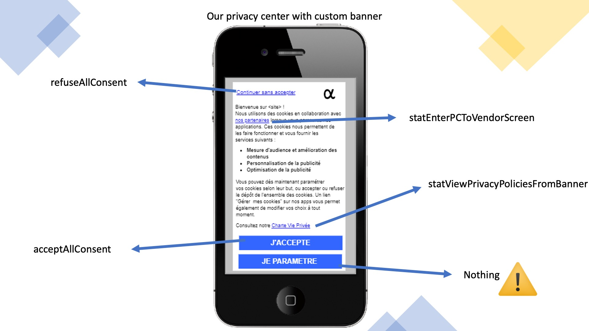
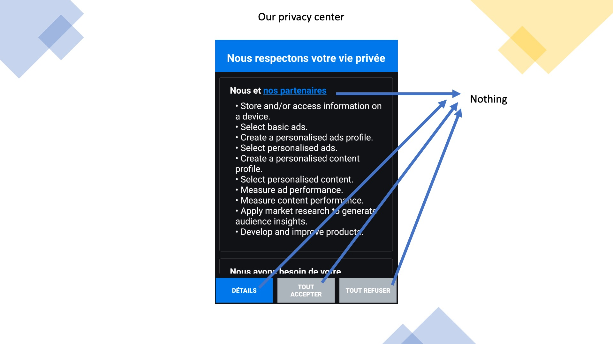
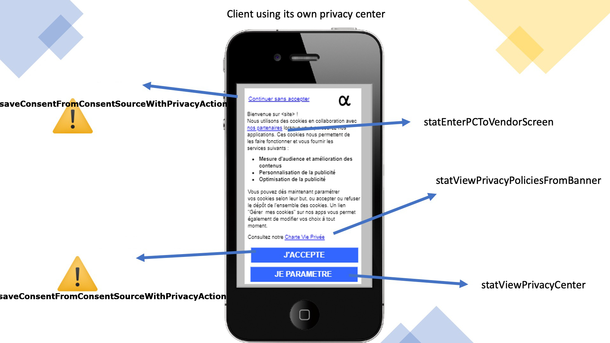
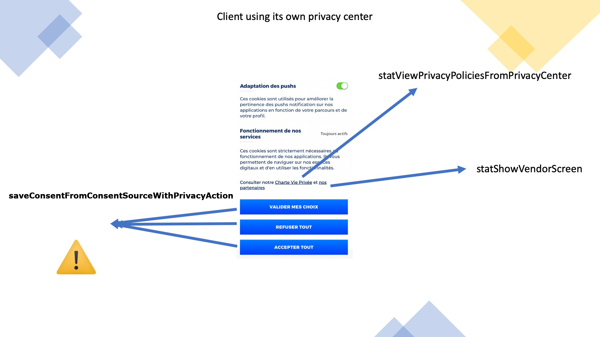

Custom-Built Consent management UI Developer Guide
==================================================

This reference documents the full set of SDK functions available for building your own custom user interfaces for consent management — whether you are implementing a consent banner or a privacy center. 

Each function listed below corresponds to a specific user-facing action or control within the consent flow. To help you navigate the integration, annotated screenshots are provided beneath each section, visually mapping every button, toggle, and interactive element to its corresponding SDK function call.

Copy/paste-able list of functions for custom interfaces:

```java
        TCConsent.getInstance().saveConsentFromConsentSourceWithPrivacyAction(consent, ETCConsentSource.Popup, ETCConsentAction.RefuseAll);
        TCConsent.getInstance().statEnterPCToVendorScreen();
        TCConsent.getInstance().statViewPrivacyPoliciesFromBanner();
        TCConsent.getInstance().statViewPrivacyPoliciesFromPrivacyCenter();
        TCConsent.getInstance().statViewPrivacyCenter();
        TCConsent.getInstance().statShowVendorScreen();
```

> [!WARNING]
> Please note that you will need to call **statViewBanner** when you display your custom banner.






Support and contacts
====================


***
**Support**
*support@commandersact.com*

http://www.commandersact.com

Commanders Act | 25 rue de Tolbiac, 75013 Paris - France
***

This documentation was generated on ${build_date} ${build_time}